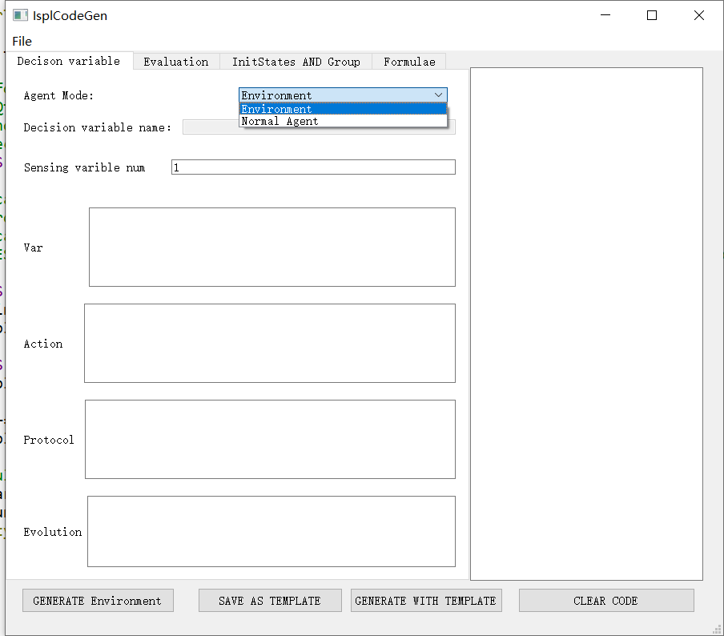
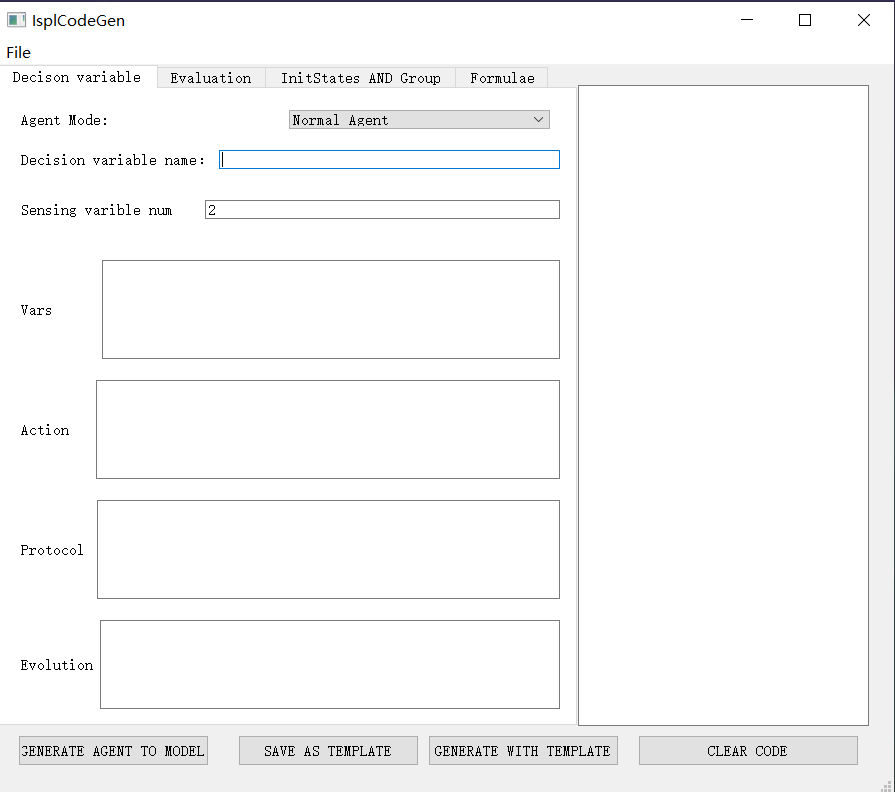

## Introduction
This project is used to generate ispl code used for MCMAS tool. MCMAS is a Model Checker for Multi-Agent Systems (MAS). MCMAS takes in input a MAS specificationand a set of formulae to be verified, and it evaluates the truth value of these formulae using algorithms based on Ordered Binary Decision Diagrams.
The project is still in the early development stage and more content is still being improved.

## Development tools and versions
QT 5.14.2

## How to run?
1. open the terminal and clone this repository to your local host

```
git clone git@github.com:Echo-b/IsplCodeGen.git
```

2.  configuire this project with Qt Creator
   
3.  build & run the project

## how to use?
when we successfully start the project, then we can see the window.



If you want to generate an Enviroment agent, we can keep it. Otherwise you want generate the normal agent code, you should change the Agent Mode,setting it to `Noraml Agent` mode. Then,you will see the window.



Next,you should input your agent name and complete other parts.

When you finish all the steps, you can click the 'GENERATE AGENT TO MODEL'. you will get the agent code and display on the right pannel. 

If you have 2 Sensing varibles. you should set the "Sensing varible num" value to 2. Other operations are the same as above.  

If you want to generate a bakeup with current agent,you should click the "SAVE AS TEMPLATE" button firstly, then click the "GENERATE WITH TEMPLATE" button.This function realizes multi-channel detection and adds redundant backup by adding multiple agents.

When you have finished typing the other sections,such as "Evalution", "Formulae" etc. Firstly you will see the whole ispl code on the right pannel. You can choose the "File=>Export" function to export it to a new file.

